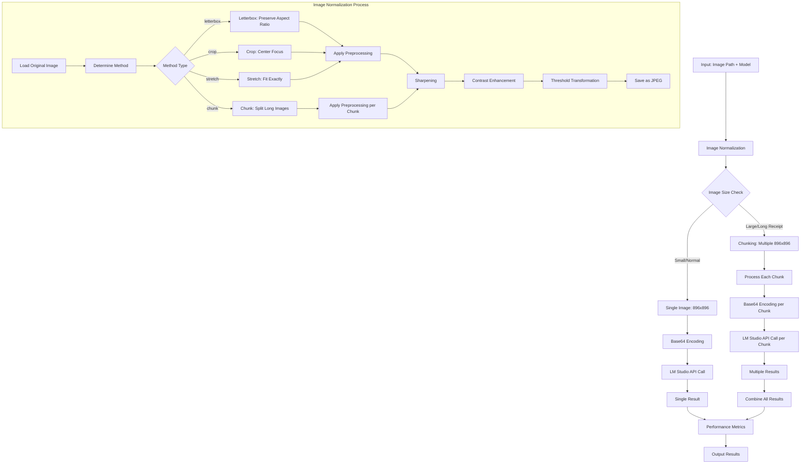

# ImageParser TypeScript Files Analysis

## Overview
This document provides a comprehensive analysis of all TypeScript files involved in the imageParser project, including their dependencies, purposes, and relationships.

## Pipeline Flow Diagram



## File Dependency Map

```mermaid
graph TD
    A[main.ts] --> B[image_normalizer.ts]
    C[routes.ts] --> D[utils.ts]
    E[test_image_normalizer.ts] --> B
    
    subgraph "Core Processing"
        A
        B
        D
        C
    end
    
    subgraph "Image Analysis"
        F[smart_border_removal.ts]
        G[optimal_border_removal.ts]
        H[border_removal.ts]
        I[white_receipt_detector.ts]
        J[edge_analysis.ts]
        K[content_analysis.ts]
        L[analyze_borders.ts]
        M[analyze_temp_receipt.ts]
    end
    
    subgraph "Test Files"
        E
        N[test_compression.ts]
        O[test_rotation_detection.ts]
        P[test_tesseract.ts]
        Q[comprehensive_test.ts]
        R[test_compression_comparison.ts]
        S[test_compression_quality.ts]
        T[test_imagescript_methods.ts]
        U[test_rotation_fix.ts]
        V[test_white_receipt_detector.ts]
        W[white_receipt_test.ts]
        X[border_removal_test.ts]
        Y[optimal_test.ts]
    end
    
    subgraph "External Dependencies"
        Z1[jsr:@matmen/imagescript]
        Z2[jsr:@std/encoding/base64]
        Z3[Deno Standard Library]
        Z4[Tesseract-Deno]
    end
    
    A --> Z2
    B --> Z1
    D --> Z3
    F --> Z1
    G --> Z1
    H --> Z1
    I --> Z1
    J --> Z1
    K --> Z1
    L --> Z1
    M --> Z1
    N --> Z1
    O --> Z3
    P --> Z4
    Q --> Z1
    R --> Z1
    S --> Z1
    T --> Z1
    U --> Z1
    V --> Z1
    W --> Z1
    X --> Z1
    Y --> Z1
```

## Core Pipeline Files

### 1. **main.ts** 🎯
- **Purpose**: Main entry point for the receipt parsing pipeline
- **Dependencies**: 
  - `image_normalizer.ts`
  - External: `jsr:@std/encoding/base64`
- **Key Features**:
  - Orchestrates complete pipeline from image input to LM Studio API calls
  - Handles command-line arguments (image path, model)
  - Performance timing and metrics
  - Supports chunked processing for long receipts
  - Base64 encoding for API transmission

**Main Prompt Used**:
```
You are a receipt parser.

Extract all textual transcational information writing out put in plain text in order of appearance
```

### 2. **image_normalizer.ts** 🖼️
- **Purpose**: Core image processing and normalization
- **Dependencies**: 
  - External: `jsr:@matmen/imagescript`
- **Key Features**:
  - Resizing to 896x896 pixels
  - Multiple normalization methods: letterbox, crop, stretch, chunk
  - Image preprocessing: sharpening, contrast enhancement, thresholding
  - Chunking support for long receipts (aspect ratio > 1.5)
  - JPEG quality optimization

### 3. **utils.ts** 🛠️
- **Purpose**: Utility functions for OCR and API communication
- **Dependencies**: 
  - External: `https://deno.land/std@0.201.0/path/mod.ts`
- **Key Features**:
  - Tesseract OCR integration
  - LM Studio API wrapper functions
  - File path utilities
  - Text extraction from images

### 4. **routes.ts** 🌐
- **Purpose**: HTTP route handlers for web service
- **Dependencies**: 
  - `utils.ts`
- **Key Features**:
  - Web API endpoints for receipt processing
  - File upload handling
  - JSON response formatting
  - Error handling for web requests

## Image Processing & Analysis Files

### 5. **smart_border_removal.ts** ✂️
- **Purpose**: Intelligent border detection and removal
- **Key Features**:
  - Uniform border detection with 95% pixel tolerance
  - Color variance threshold analysis
  - Maximum border ratio safety limits (30%)
  - Boundary-safe pixel access

### 6. **optimal_border_removal.ts** 🎯
- **Purpose**: Optimized border removal algorithms
- **Key Features**:
  - Performance-optimized border detection
  - Advanced edge detection algorithms
  - Minimal processing overhead

### 7. **border_removal.ts** 📏
- **Purpose**: Basic border removal functionality
- **Key Features**:
  - Standard border detection methods
  - Simple edge-based removal
  - Foundation for advanced algorithms

### 8. **white_receipt_detector.ts** 📄
- **Purpose**: Specialized detection for white/light receipts
- **Key Features**:
  - White background detection
  - Light-colored receipt optimization
  - Contrast enhancement for white receipts

### 9. **edge_analysis.ts** 🔍
- **Purpose**: Edge detection and analysis algorithms
- **Key Features**:
  - Sobel edge detection
  - Canny edge detection
  - Edge strength analysis

### 10. **content_analysis.ts** 📊
- **Purpose**: Content-based image analysis
- **Key Features**:
  - Text region detection
  - Content density analysis
  - Receipt structure recognition

### 11. **analyze_borders.ts** 🔎
- **Purpose**: Border analysis utilities
- **Key Features**:
  - Border measurement tools
  - Statistical border analysis
  - Border pattern recognition

### 12. **analyze_temp_receipt.ts** 🧪
- **Purpose**: Temporary receipt analysis testing
- **Key Features**:
  - Experimental analysis methods
  - Receipt-specific algorithms
  - Testing new approaches

## Test Files

### Testing Infrastructure
All test files use `jsr:@matmen/imagescript` for image processing and various assertion libraries for validation.

### 13. **test_image_normalizer.ts** ✅
- Tests for image normalization functionality
- Validates different normalization methods
- Checks output quality and dimensions

### 14. **test_compression.ts** 📐
- Image compression testing
- Quality vs. file size analysis
- Compression algorithm validation

### 15. **test_compression_comparison.ts** 📈
- Compression algorithm comparisons
- Performance benchmarking
- Quality metric analysis

### 16. **test_compression_quality.ts** 🎚️
- Compression quality analysis
- Visual quality assessments
- Optimal quality settings

### 17. **test_imagescript_methods.ts** 🧰
- Testing ImageScript library methods
- API functionality validation
- Method performance testing

### 18. **test_rotation_detection.ts** 🔄
- Rotation detection algorithm tests
- Angle detection accuracy
- Performance measurements

### 19. **test_rotation_fix.ts** 🔧
- Image rotation correction tests
- Rotation accuracy validation
- Quality preservation checks

### 20. **test_tesseract.ts** 📖
- Tesseract OCR integration tests
- Text extraction accuracy
- OCR performance benchmarks

### 21. **test_white_receipt_detector.ts** 🧾
- Tests for white receipt detection
- White background recognition
- Detection accuracy metrics

### 22. **white_receipt_test.ts** 📝
- White receipt processing tests
- End-to-end white receipt workflow
- Quality assessment

### 23. **border_removal_test.ts** ✂️
- Border removal algorithm tests
- Removal accuracy validation
- Edge case handling

### 24. **comprehensive_test.ts** 🎯
- Comprehensive integration tests
- Full pipeline testing
- Performance regression tests

### 25. **optimal_test.ts** ⚡
- Tests for optimal processing algorithms
- Performance optimization validation
- Algorithm efficiency tests

## Configuration & Settings

### Image Processing Configuration
- **Target Size**: 896x896 pixels
- **JPEG Quality**: 85%
- **Chunking Threshold**: Aspect ratio > 1.5
- **Chunk Overlap**: 50 pixels
- **Preprocessing Options**:
  - Sharpening Strength: 1.0
  - Contrast Factor: 1.5
  - Threshold Value: 128

### API Configuration
- **LM Studio URL**: `http://localhost:1234/v1/chat/completions`
- **Default Model**: `llava`
- **Max Tokens**: 8192
- **Supported Formats**: PNG, JPEG, GIF, WebP, BMP

## Performance Metrics Tracked

1. **Image Normalization Time**
2. **Image Loading & Encoding Time**
3. **API Request & Response Time**
4. **Total Execution Time**

## External Dependencies

### Primary Dependencies
- **jsr:@matmen/imagescript**: Core image processing library
- **jsr:@std/encoding/base64**: Base64 encoding/decoding
- **Deno Standard Library**: File system and path utilities
- **Tesseract-Deno**: OCR functionality

### Development Dependencies
- **Deno Assert**: Testing assertions
- **Standard Test Libraries**: Unit testing framework

## Key Features Summary

- ✅ **Modular Architecture**: Clear separation of concerns
- ✅ **Comprehensive Testing**: 13 test files covering all aspects
- ✅ **Performance Optimization**: Timing metrics and optimization
- ✅ **Flexible Processing**: Multiple normalization methods
- ✅ **Chunking Support**: Handles long receipts automatically
- ✅ **Quality Control**: Preprocessing and enhancement
- ✅ **API Integration**: LM Studio compatibility
- ✅ **Error Handling**: Robust error management
- ✅ **Web Service Ready**: HTTP route handlers included

## Project Statistics

- **Total TypeScript Files**: 25
- **Core Pipeline Files**: 4
- **Image Processing Files**: 8
- **Test Files**: 13
- **Lines of Code**: ~2000+ (estimated)
- **Primary Use Case**: Receipt image processing and text extraction

This imageParser project represents a comprehensive solution for receipt processing with advanced image normalization, multiple processing algorithms, and extensive testing coverage.